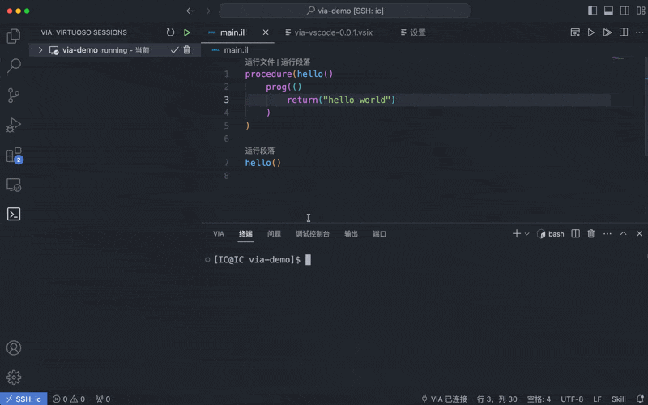
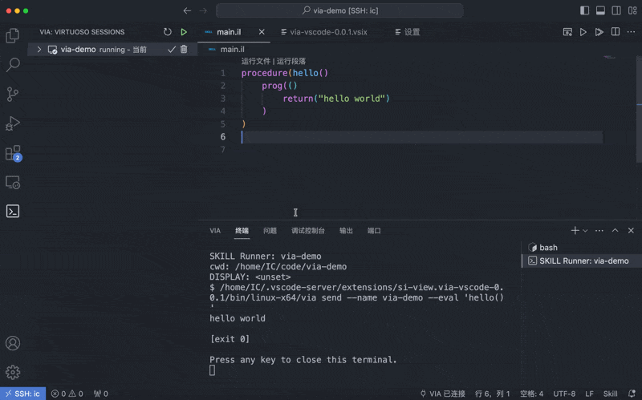

# SKILL Runner - Via

[English](./README.md) | [简体中文](./README.zh-CN.md)

通过 [`via`](https://github.com/si-view/via) 在 VS Code 中运行 Cadence SKILL。

SKILL Runner 支持加载 `.il` 文件、执行选中的 SKILL 代码、使用交互式 SKILL 面板，并在 VS Code 内管理 Virtuoso 工作区。

## 功能

- 通过编辑器标题按钮、CodeLens、右键菜单或命令面板运行当前 `.il` 文件。
- 执行当前选区；未选择内容时，执行光标所在段落。
- 打开交互式 SKILL 面板，反复执行代码片段。
- 通过状态栏选择、新建、启动、刷新和查看 VIA 工作区。
- 在 VIA 活动栏中查看正在运行的 Virtuoso 会话。
- 在运行代码前自动启动选中的工作区。
- 配置 DISPLAY，适配本地 X11、X11 转发或无显示环境。
- 使用插件内置 Linux `via` 二进制，或指定自定义可执行文件。

## 环境要求

- VS Code `1.85.0` 或更高版本。
- Linux VS Code 扩展主机。
- Linux 主机上可用的 Cadence Virtuoso 环境。

本地桌面可以是 Windows 或 macOS；只要 VS Code 连接到 Linux 远程主机，例如 Remote SSH、Dev Containers 或其他远程扩展主机，即可使用。

## 快速开始

1. 在 Linux 主机上打开文件夹或工作区。
2. 打开 `.il` 后缀的 SKILL 文件。
3. 运行 `VIA: Configure Workspace`。
4. 选择 Virtuoso 工作区目录。
5. 选择 DISPLAY 传递方式。
6. 运行 `VIA: Start Workspace`、`VIA: Run Current File` 或 `VIA: Run Selection or Paragraph`。

VIA 状态栏入口会显示当前连接状态。点击它可以刷新状态、切换工作区、启动工作区或查看状态详情。

## 演示

### 工作区配置



### 运行段落



### 使用 VNC DISPLAY 启动

当远程 Linux 主机上的 Virtuoso 需要 GUI 时，可以使用 VNC 提供 DISPLAY。

<video controls title="使用 VNC DISPLAY 启动 SKILL Runner">
  <source src="https://raw.githubusercontent.com/si-view/via-vscode/master/media/VNCDisplay.mp4" type="video/mp4">
</video>

## 命令

| 命令 | 说明 |
| --- | --- |
| `VIA: Configure Workspace` | 选择 Virtuoso 工作区路径并配置 DISPLAY。 |
| `VIA: Select Workspace` | 切换到当前、已知或正在运行的工作区。 |
| `VIA: New Workspace` | 新建并选择一个工作区预设。 |
| `VIA: Start Workspace` | 启动选中的工作区。 |
| `VIA: Refresh Connection Status` | 检查选中工作区是否正在运行。 |
| `VIA: Show Status Details` | 查看工作区、实例、DISPLAY、自动启动和最近命令信息。 |
| `VIA: Run Current File` | 在选中的工作区中运行当前 `.il` 文件。 |
| `VIA: Run Selection or Paragraph` | 执行当前选区或推断出的段落。 |
| `VIA: Open Interactive SKILL` | 聚焦交互式 SKILL 面板。 |
| `VIA: Run Interactive SKILL` | 运行交互式面板中的当前代码。 |
| `VIA: Clear Interactive SKILL` | 清空交互式面板内容。 |
| `VIA: Refresh Sessions` | 刷新 VIA 会话视图。 |
| `VIA: Select Session` | 从会话视图中选择一个会话。 |
| `VIA: Kill Session` | 终止选中的 VIA 会话。 |

旧命令名，例如 `VIA: Start Kernel` 和 `VIA: Configure Session`，仍保留兼容。

## 扩展设置

此扩展贡献以下设置项：

| 设置项 | 默认值 | 说明 |
| --- | --- | --- |
| `via.commandPath` | `""` | 自定义 `via` 可执行文件路径。留空时使用插件内置二进制。 |
| `via.language` | `auto` | 运行时界面语言。`auto` 跟随 VS Code 显示语言。 |
| `via.defaultWorkspace` | `""` | 配置工作区时默认显示的 Virtuoso 工作区路径。 |
| `via.defaultInstanceName` | `vscode` | 默认 VIA 内部实例名。 |
| `via.displayMode` | `inherit` | DISPLAY 传递方式：`inherit`、`custom` 或 `unset`。 |
| `via.displayValue` | `""` | `via.displayMode` 为 `custom` 时使用的 DISPLAY 值。 |
| `via.environmentScript` | `""` | 执行 `via` 前 source 的 shell 脚本，适合导入 Virtuoso、license 等环境变量。 |
| `via.environmentScriptShell` | `auto` | source `via.environmentScript` 时使用的 shell：`auto`、`bash`、`sh`、`zsh`、`csh` 或 `tcsh`。`auto` 使用用户默认 shell。 |
| `via.knownWorkspaces` | `[]` | 工作区选择器中显示的可选预设。 |
| `via.autoStartWorkspace` | `true` | 选中工作区未运行时，在执行代码前自动启动。 |
| `via.loadOnSave` | `false` | 保存 `.il` 文件时自动运行。 |

以下旧设置项仍会被读取以保持兼容：

- `via.knownKernels`
- `via.autoStartKernel`
- `via.useDisplay`

## DISPLAY 模式

SKILL Runner 支持三种 DISPLAY 模式：

- `inherit`：沿用扩展主机的 `DISPLAY` 环境变量。
- `custom`：使用 `via.displayValue` 指定 DISPLAY，例如 `:0` 或 `localhost:10.0`。
- `unset`：执行时移除 DISPLAY 环境变量。

可以通过 `VIA: Configure Workspace` 在 VS Code 中选择。

如果 `via.displayMode` 为 `inherit`，但扩展主机环境和 `via.displayValue` 都没有提供 DISPLAY，SKILL Runner 默认不传 DISPLAY。无 DISPLAY 启动工作区时，会自动给 `via start` 添加 `--nograph`。

## 环境变量脚本

可以通过 `via.environmentScript` 指定一个 shell 脚本，在每次执行 `via` 前加载 Virtuoso 所需环境变量。

Bash 风格示例：

```json
{
  "via.environmentScript": "/path/to/virtuoso-env.sh",
  "via.environmentScriptShell": "bash"
}
```

```bash
export CDS_LIC_FILE=5280@license-server
export PATH=/path/to/cadence/bin:$PATH
```

C shell 风格示例：

```json
{
  "via.environmentScript": "/path/to/virtuoso-env.csh",
  "via.environmentScriptShell": "csh"
}
```

```csh
setenv CDS_LIC_FILE 5280@license-server
setenv PATH /path/to/cadence/bin:${PATH}
```

当 `via.environmentScriptShell` 为 `auto` 时，SKILL Runner 会使用用户默认的 `SHELL`。加载 `via.environmentScript` 前，bash 会先加载 `~/.bashrc`，zsh 会先加载 `~/.zshrc`，csh/tcsh 会先加载 `~/.cshrc`。

## 已知问题

- 扩展主机必须运行在 Linux 上。本地 Windows 或 macOS 窗口需要连接到 Linux 远程主机。
- 如果开发构建中找不到内置 `via` 二进制，请运行 `npm run build`，或设置 `via.commandPath`。
- 如果 Virtuoso 无法连接显示，请检查 `via.displayMode`、`via.displayValue` 和远程主机的 `DISPLAY` 环境变量。

## 发布说明

### 0.0.1

SKILL Runner 初始版本，支持在 VS Code 中运行 SKILL 文件、选区代码和交互式片段。

## 开发

安装依赖：

```bash
npm install
```

构建扩展：

```bash
npm run build
```

生成 `.vsix` 安装包：

```bash
npm run package
```

打包流程会下载并内置 Linux `x64` 与 `arm64` 的 `via` 二进制，分别放在 `bin/linux-x64/` 和 `bin/linux-arm64/`。

运行 TypeScript 检查：

```bash
npm run lint
```

`npm run build` 会下载最新 Linux `via` release，并在 TypeScript 编译前安装到 `bin/<platform>-<arch>/via`。

离线 TypeScript 构建可以使用：

```bash
VIA_SKIP_DOWNLOAD=1 npm run build
```

## 公众号

欢迎关注公众号「芯上视图」：


## 仓库

- VIA CLI：<https://github.com/si-view/via>
- 扩展源码：<https://github.com/si-view/via-vscode>
- 问题反馈：<https://github.com/si-view/via-vscode/issues>

## 许可证

MIT
